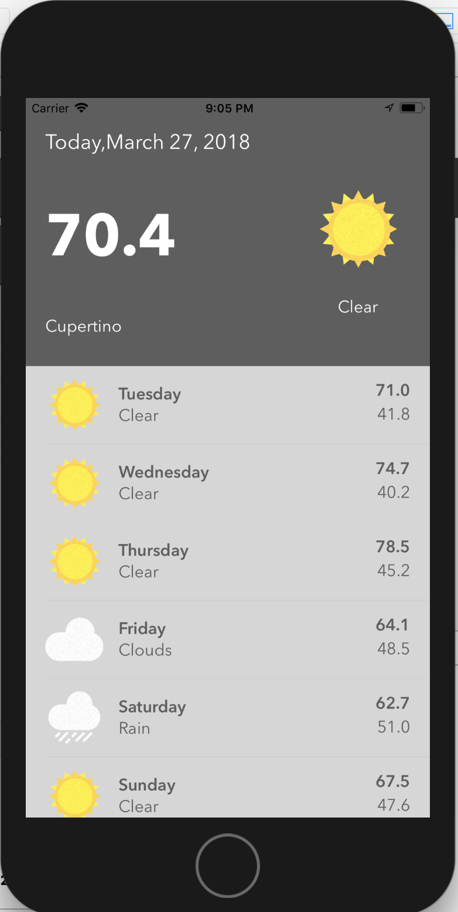
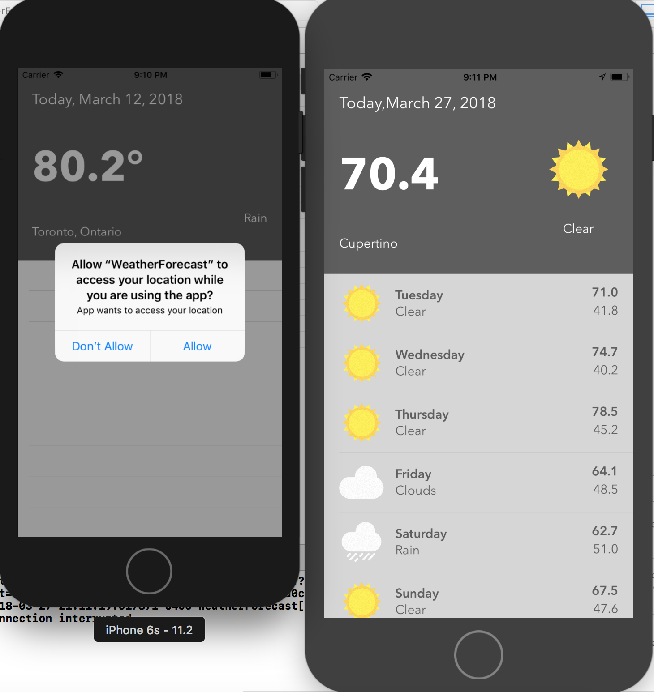

# WeatherForecast

This single-view application uses :

 <ul>
  <li>Alamofire pod library to parse Json obtained from openweathermap API</li>
  <li>Auto Layout</li>
  <li>Components designed in Sketch</li>
  <li>CLLocation Manager to fetch the present coordinates</li>
 </ul>

Main Weather Forecast Screen

Device Comparison and Location request Authorisation Screen

